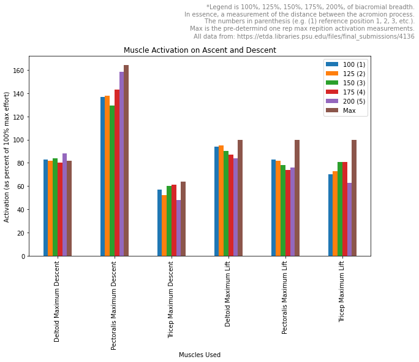
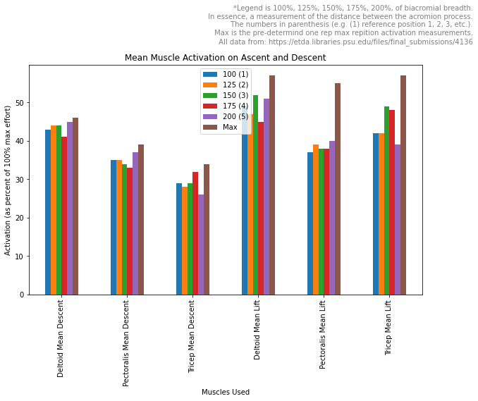

# BenchMuscleActivation
## Data visualization of electrical signals to muscles during bench press

*All data gathered from the information and tables from: Duffey, M. A Biomechanical Analysis of The Bench Press. A Dissertation in Kinesiology, Pennsylvania State University. 2008. [This is a link]https://etda.libraries.psu.edu/files/final_submissions/4136*

## Data gathered from this study has been extracted, transformed, and loaded into graphs
The goal for this data manipulation was:
* See the muscles used during a bench press via electormyographic (EMG) activity
* Change grip width and see how the EMG activity changes at different muscle sites
* Isolate which grip width is best to target different muscle groups
* Learn to get a better upper body "pump" via data

### Grip width measurements:
* 100(1)
* 125(2)
* 150(3)
* 175(4)
* 200(5)
* Max

The first four measurements are biacromial breadth measurements. 

*Biacromial breadth refers to the measurement of the width or distance between the two acromion processes, which are bony structures located at the top of the shoulder blades. It is an anatomical measurement that helps determine the width of a person's shoulders*

Max refers to the one rep maximum on a free weight bench press.

## Image 1

### Results
During the eccentric (descent) phase of a bench press, at all grip widths: 
* the pectoralis muscles are most active 
* the deltoids are second most active
* the triceps are least active

During the concentric (lifting) phase of the the bench press:
* The deltoids are most active across all grip widths
* the pectoral muscles are generall more active than the triceps
* the triceps are less activated than the pectoral muscles except at 150 and 175 where the triceps are much more active than the pectoral muscles

During a max effort:
* The Pectoral muscles are most activated on the descent
* The deltoids are second most activated on the descent
* The triceps are least activated
* During the concentric phase all three muscle groups are equally activated

## Image 2

### Results
The average EMG activity tells a slightly different story
During the eccentric (descent) phase:
* The deltoids have the highest averages for EMG activity
* The pecs have the second highest EMG activity
* The triceps have the least amount of EMG activity (except at grip width 175, where they are almost as activated as the pecs)

During the concentric (lift) phase:
* Deltoids generally have more EMG activity
* Pecs have the lowest EMG activity
* The triceps have slightly higher EMG activity than the pecs (except at grip witdth 200)

## Overall
The numbers show us that the flat bench press is a good upper body workout. The deltoids and the pecs will likely benefit the most from this exercise. 

